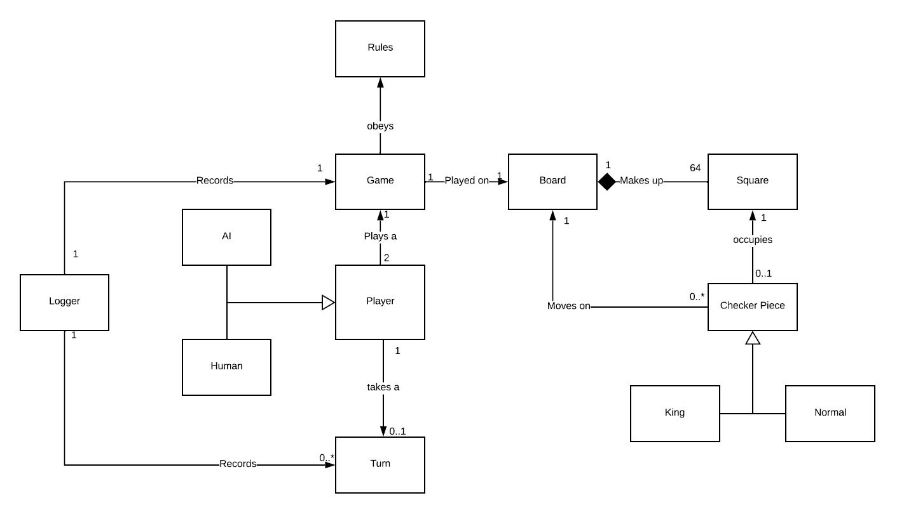
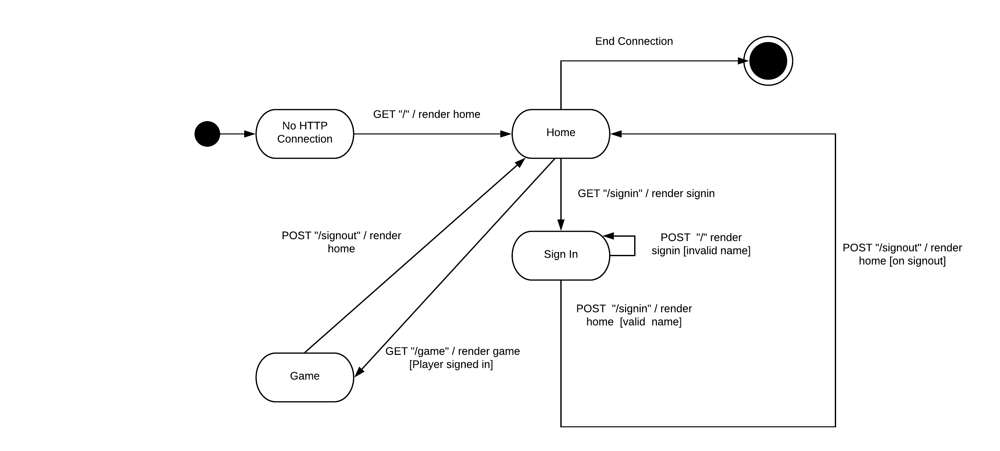

# PROJECT Design Documentation

> _The following template provides the headings for your Design
> Documentation.  As you edit each section make sure you remove these
> commentary 'blockquotes'; the lines that start with a > character
> and appear in the generated PDF in italics._

## Team Information
* Team name: TEAM-A
* Team members
  * Aahish Balimane
  * Aaron Peterham
  * Hugh Gallo
  * AbuBakr Ghaznavi

## Executive Summary

This is a Web based Application for the WebChecker Game. Players can log into there account and play the game of WebChecker with anyone who is present in the lobby. The game of WebCheckers is a board game where each player is given 12 pieces of color. The goal of the game is to eliminate all the opponent pieces present on the game board.

### Purpose
> _Provide a very brief statement about the project and the most
> important user group and user goals._

Users of the WebCheckers application sign in in order to challenge other players to and play games of Checkers.

### Glossary and Acronyms
> _Provide a table of terms and acronyms._

| Term | Definition |
|------|------------|
| VO | Value Object |

## Requirements

This section describes the features of the application.

> Players must be able to sign-in to the application and play a game against other players. By using drag and drop capabilities,
> players can move pieces through the board, capturing or jumping over opponents' pieces.
> If players reach their opponent's end of the board, they will be "kinged", granting that piece the ability to move both forward and backward.
> While playing, either player can resign, ending the game and forfeiting the match.
> Players will also be able to play against a computer opponent and be able to watch replays of their matches.

### Definition of MVP
> Each player must be able to sign in before playing a game and be able to sign out when finished playing.
> Two players must be able to play a game of checkers based upon the American rules. Either player may choose to resign at any point,
> which ends the game.

### MVP Features
> _Provide a list of top-level Epics and/or Stories of the MVP._

* #### Player Sign-in
    * As a player, I want to be able to sign-in so that I can play a game of checkers
* #### Player Sign-out
    * As a player who is signed into WebCheckers, I want to be able to sign out so that I am not placed in any new games
* #### Start a Game
    * As a Player, I want to start a game so that I can play checkers against an opponent. 
* #### Single Move
    * As a Player, I want to be able to move my pieces diagonally away from me so that I can advance towards the far end of the board
* #### Backwards Move
    * As a player with a kinged piece, I want to complete a simple move, a single jump move, or a multiple jump move with kinged pieces but towards my side of the board so I can reposition or capture opponent’s pieces with my kinged piece.
* #### Jump Moves
    * As a Player, I want to make a jump move so that I can advance forward.
    * ##### Single Jump Move
        * As the player, I want to be able to move an eligible piece in a jump over opponents diagonally towards the opponent so I can capture an enemy piece.
    * ##### Multiple Jump Move
        * As the player, I want to move an eligible piece in multiple jumps over opponent’s pieces diagonally in a recursive fashion towards the opponent so I can capture multiple enemy pieces.
* #### Resignation
    * The player must be able to resign any game he or she is playing.
    * ##### Win 
        * As a player who won the game, I want to see the results of a completed game so I can know who won.
    * ##### Lose
        * As a player who lost the game, I want to see the results of a completed game so I can know who won.
 * #### King
    * As a player with a piece in the final row, I want to be forced to king my piece when the piece reaches the row closest to my opponent, so I follow the rules of the game.
    
    

### Roadmap of Enhancements
> _Provide a list of top-level features in the order you plan to consider them._

* #### AI Opponent
    * The player must be able to play against a computer opponent.
* #### Replay Mode
    * The player must be able to watch replays of their match so they can improve their skills.

## Application Domain

This section describes the application domain.

<!-- Below are the entities involved in the Checkers application domain. In every game of Checkers
there always exists two players who control pieces that occupy squares on the board.
There is a logical concept of a "game" between these two players that is modeled in the diagram
for cohesion. --> 

> _Provide a high-level overview of the domain for this application. You
> can discuss the more important domain entities and their relationship
> to each other._

The WebCheckers application consists of several related elements to form the application. 
The Game is the central element. A game consists of two players (who can be either an AI or Human).
These players manipulate pieces that can occupy the 64 squares on the board. These pieces can either be
normal pieces or king pieces. Each player takes turn making their moves. While manipulating the pieces, the moves made
have to obey the rules of the game which are the standard American rules.

## Architecture and Design

This section describes the application architecture.

### Summary

The following Tiers/Layers model shows a high-level view of the webapp's architecture.

As a web application, the user interacts with the system using a
browser.  The client-side of the UI is composed of HTML pages with
some minimal CSS for styling the page.  There is also some JavaScript
that has been provided to the team by the architect.

The server-side tiers include the UI Tier that is composed of UI Controllers and Views.
Controllers are built using the Spark framework and View are built using the FreeMarker framework.  The Application and Model tiers are built using plain-old Java objects (POJOs).

Details of the components within these tiers are supplied below.

### Overview of User Interface

This section describes the web interface flow; this is how the user views and interacts
with the WebCheckers application.

> _Provide a summary of the application's user interface.  Describe, from
> the user's perspective, the flow of the pages in the web application._

A Player starts from having no connection to the Webserver to connecting through the home page.
Once a user is connected to the home page, they are presented with some welcome information about the application.
They can either choose to sign in at this point, or exit the application and terminate their connection. If a player chooses
to sign in, they will be presented with a form page to enter a valid user name. If the username is invalid they will 
return to this page with an error message telling them the format of a proper username. If the username is valid, they will
return to the home page being able to select from the other players to challenge a game. Once a player,
enters a game they will enter the game page which displays the board and pieces. When either player wins or loses, they can go back to the home page and either
select another game or sign-out. 

### UI Tier
> _Provide a summary of the Server-side UI tier of your architecture.
> Describe the types of components in the tier and describe their
> responsibilities.  This should be a narrative description, i.e. it has
> a flow or "story line" that the reader can follow._

> _At appropriate places as part of this narrative provide one or more
> static models (UML class structure or object diagrams) with some
> details such as critical attributes and methods._

> _You must also provide any dynamic models, such as statechart and
> sequence diagrams, as is relevant to a particular aspect of the design
> that you are describing.  For example, in WebCheckers you might create
> a sequence diagram of the `POST /validateMove` HTTP request processing
> or you might show a statechart diagram if the Game component uses a
> state machine to manage the game._

> _If a dynamic model, such as a statechart describes a feature that is
> not mostly in this tier and cuts across multiple tiers, you can
> consider placing the narrative description of that feature in a
> separate section for describing significant features. Place this after
> you describe the design of the three tiers._

### Application Tier
> _Provide a summary of the Application tier of your architecture. This
> section will follow the same instructions that are given for the UI
> Tier above._

### Model Tier
> _Provide a summary of the Application tier of your architecture. This
> section will follow the same instructions that are given for the UI
> Tier above._

### Design Improvements
> _Discuss design improvements that you would make if the project were
> to continue. These improvement should be based on your direct
> analysis of where there are problems in the code base which could be
> addressed with design changes, and describe those suggested design
> improvements. After completion of the Code metrics exercise, you
> will also discuss the resutling metric measurements.  Indicate the
> hot spots the metrics identified in your code base, and your
> suggested design improvements to address those hot spots._

## Testing
> _This section will provide information about the testing performed
> and the results of the testing._

### Acceptance Testing
> _Report on the number of user stories that have passed all their
> acceptance criteria tests, the number that have some acceptance
> criteria tests failing, and the number of user stories that
> have not had any testing yet. Highlight the issues found during
> acceptance testing and if there are any concerns._

### Unit Testing and Code Coverage
> _Discuss your unit testing strategy. Report on the code coverage
> achieved from unit testing of the code base. Discuss the team's
> coverage targets, why you selected those values, and how well your
> code coverage met your targets. If there are any anomalies, discuss
> those._
